<p align="right">
  <a href="./README.md">English</a> · <a href="./README.es.md">Español</a> · <strong>Deutsch</strong>
</p>

<p align="center">
  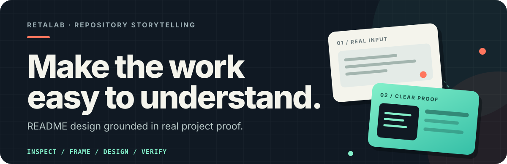
</p>

<p align="center">
  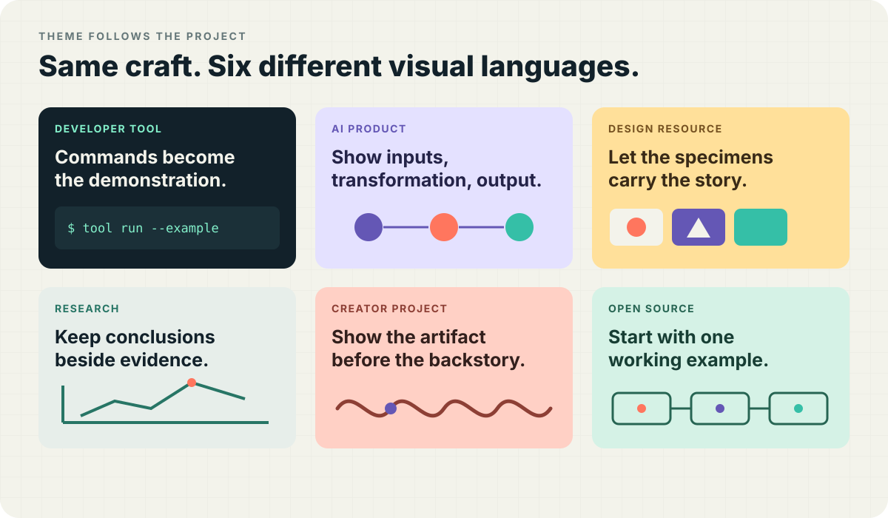
</p>

Repository-READMEs strukturieren und gestalten, damit Projektwert, echte Beispiele, Installation und Nutzungsgrenzen leichter verständlich sind.

Die folgenden vier unabhängigen Hero-Ansätze verwenden keinen einheitlichen Stil. Typografie, Farben, Komposition und Belege leiten sich jeweils aus dem Projekt selbst ab.

<p align="center">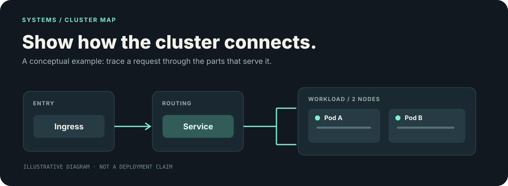</p>
<p align="center">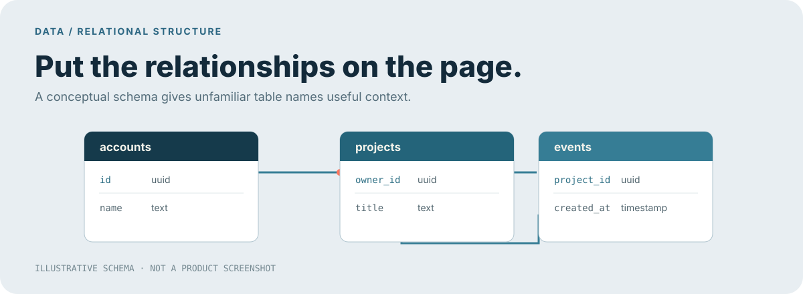</p>
<p align="center">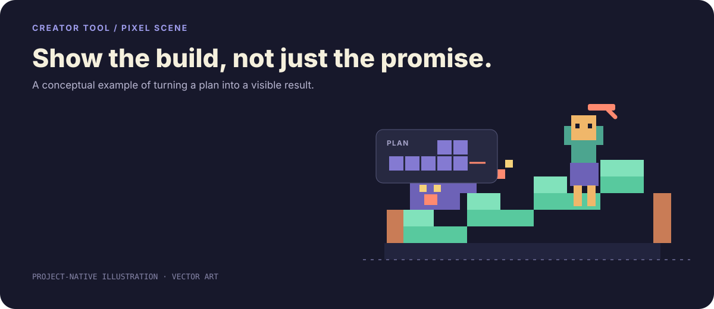</p>

**Block World** zeigt einen spielerischen Hybridansatz: SVG gestaltet Pixeltypografie, Raster, Beschriftungen und Szenenaufbau. ImageGen und Chroma-Key-Freistellung liefern die Figur, die deterministisch schwer zu zeichnen wäre.

<p align="center">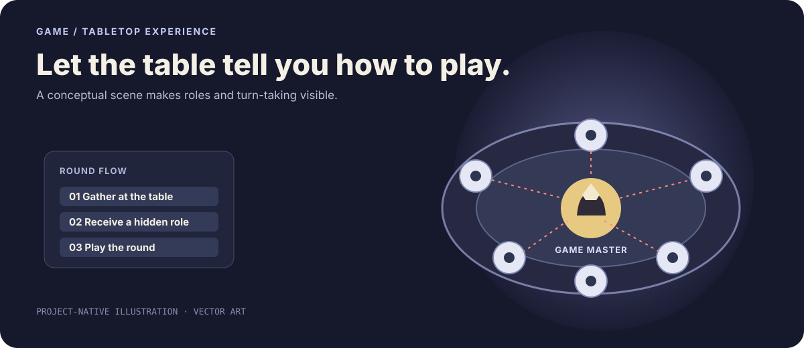</p>

<p align="center">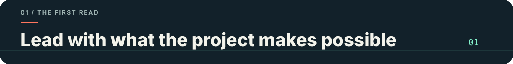</p>

Die meisten Repositories enthalten bereits genug Informationen. Oft stimmt nur die Reihenfolge nicht: Besucher sehen interne Begriffe, Installationsbefehle und Verzeichnisbäume, bevor sie den Zweck des Projekts verstehen.

`beautify-github-readme` liest zuerst das tatsächliche Repository, ermittelt den klarsten Nutzen und Beleg und entscheidet erst danach über die Gestaltung.

<p align="center">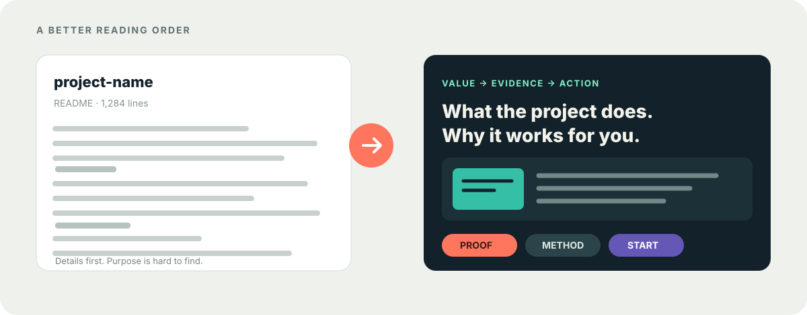</p>

Im Modus „Gesamtes README“ arbeitet die Skill auf drei Ebenen:

| Inhalt | Visuelles System | Technik |
| --- | --- | --- |
| Wiederholungen entfernen, Belege nach vorn stellen und interne Fachsprache durch konkrete Ergebnisse ersetzen | Farben, Typografie, Komposition und projektspezifische Motive vor dem Entwurf von Hero und Modulen ableiten | GitHub-kompatible Assets, barrierearme Bilder, kopierbare Befehle und durchsuchbaren Text sicherstellen |

Unterschiedliche Projekte brauchen unterschiedliche Ansätze. Eine CLI kann Befehlsrhythmus und Cursor nutzen, ein Icon-System Keylines und Ausschnitte, ein Forschungsrepository Koordinaten, Diagramme und Beleglabels.

<p align="center">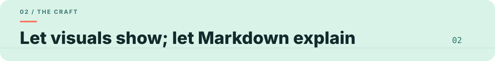</p>

GitHub-READMEs bieten weniger Layoutfreiheit als Websites. Diese Skill trennt visuelle Ebene und Inhalt:

- SVG gestaltet editierbare Heroes, Abschnittsübergänge, Vergleiche, Diagramme und Identität.
- Hybride SVG-Komposition verbindet deterministisches Layout mit optionalen KI-generierten, freigestellten Motiven für Figuren, organische Texturen, komplexe Materialien und filmisches Licht.
- GIF zeigt ausdrücklich genehmigte Bewegung; das statische SVG bleibt als editierbare Alternative erhalten.
- Animation ist optional und wird nie standardmäßig erstellt.
- PNG/WebP eignet sich für Screenshots, generierte Grafiken und komplexe Showcase-Flächen.
- Markdown enthält Erklärungen, Befehle, Links, Konfiguration und Beiträge.

So wirkt das Ergebnis gestaltet, ohne zu einem langen Bild zu werden, das niemand durchsuchen, kopieren oder pflegen kann.

Wiederverwendbare Produktionshinweise:

- [Projektspezifisches Hero gestalten](./skills/beautify-github-readme/references/project-native-hero.md)
- [GitHub-kompatible README-SVGs schreiben](./skills/beautify-github-readme/references/svg-production.md)
- [SVG mit generiertem Rastermaterial kombinieren](./skills/beautify-github-readme/references/hybrid-svg-production.md)
- [GitHub-kompatible README-Bewegung erstellen](./skills/beautify-github-readme/references/motion-production.md)

<p align="center">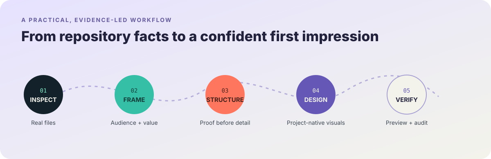</p>

Der Ablauf hält drei Zusagen ein: echtes Projektmaterial verwenden, keine Funktionen erfinden und nichts ohne ausdrückliche Freigabe veröffentlichen.

<p align="center">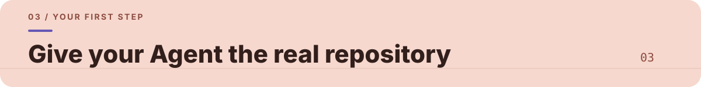</p>

**Option 1 · Über die Kommandozeile installieren**

```bash
npx skills add unrealretamal/retalab-beatiful-repository
```

**Option 2 · Agenten um Installation bitten**

```text
Installiere diese Skill: https://github.com/unrealretamal/retalab-beatiful-repository
```

Die Skill bietet zwei klar definierte Modi:

| Modus | Änderungen | Standardmäßig unangetastet |
| --- | --- | --- |
| Gesamtes README | Lesereihenfolge, Texthierarchie, Belege, Markdown und visuelles Gesamtsystem | Kein Commit, Push oder Veröffentlichung ohne Freigabe |
| Nur Assets | Statisches SVG-Hero, Abschnittsüberschriften, Ablauf, Badge, Diagramm oder optionales GitHub-kompatibles GIF samt SVG-Quelle | README-Text, Reihenfolge, Bildverweise und Links |

Ist der Umfang bereits klar, beginnt die Skill direkt. Bei einer allgemeinen Bitte wie „Gestalte dieses Repository schöner“ oder einer bloßen Repository-URL fragt der Agent:

```text
Soll ich das gesamte README verbessern oder nur visuelle Assets erstellen?
Falls nur Assets: Hero, Abschnittsüberschriften, Ablauf, Badge, Animation oder ein abgestimmtes Set?
```

**Modus „Gesamtes README“**

```text
Nutze $beautify-github-readme, um die Repository-Startseite anhand des tatsächlichen Projektthemas neu zu gestalten.
Zeige mir zuerst eine lokale Vorschau und pushe nichts.
```

**Modus „Nur Assets“**

```text
Nutze $beautify-github-readme, lasse das README unverändert und erstelle ein animiertes GIF-Hero samt SVG-Quelle.
Leite den Stil aus dem vorhandenen Projekt ab und zeige zuerst die gerenderte Vorschau.
```

Ein README als Kontext zu lesen, erteilt keine Bearbeitungserlaubnis. Im Asset-Modus braucht auch das Einbetten neuer Assets eine separate ausdrückliche Freigabe.

Eine reine Leseprüfung ist ebenfalls möglich:

```text
Prüfe dieses README mit $beautify-github-readme auf Verständlichkeit, Hierarchie, Vertrauen und Wartungsaufwand. Ändere keine Dateien.
```

Der README-Modus liefert lokale Vorschau, visuelle Assets und einen README-Diff. Der Asset-Modus liefert Quelldateien, gerenderte Vorschauen, optionale GIFs und Einbettungsbeispiele. Commits, Pushes, PRs und Veröffentlichungen benötigen immer eine ausdrückliche Genehmigung.

MIT-Lizenz

---

Dieses README dient zugleich als Beispiel: Es verbindet ein projektspezifisches Hero, eine Themenübersicht, illustrative Beispiele, Abschnittsübergänge und lesbares Markdown, statt die ganze Seite zu einem Rasterbild zu machen.

## Konfiguration, Abhängigkeiten und Nutzungsgrenzen

Markdown/SVG benötigt weder Konto noch API-Schlüssel. Für PNG/WebP oder KI-Bilderzeugung sind passende Rendering-Werkzeuge und autorisierte Generierungsdienste erforderlich.

Keine Sterne, Leistungswerte, Nutzerzahlen oder Markenempfehlungen erfinden. Nach Änderungen Links, Assets und tatsächliche Darstellung prüfen. Veröffentlichung und Merge richten sich nach der ausdrücklichen Freigabe für den jeweiligen Auftrag.

Anwendungsbeispiel:

```text
Gestalte die README-Startseite dieses Repositories neu und bewahre dabei alle tatsächlichen Projektinformationen.
```
