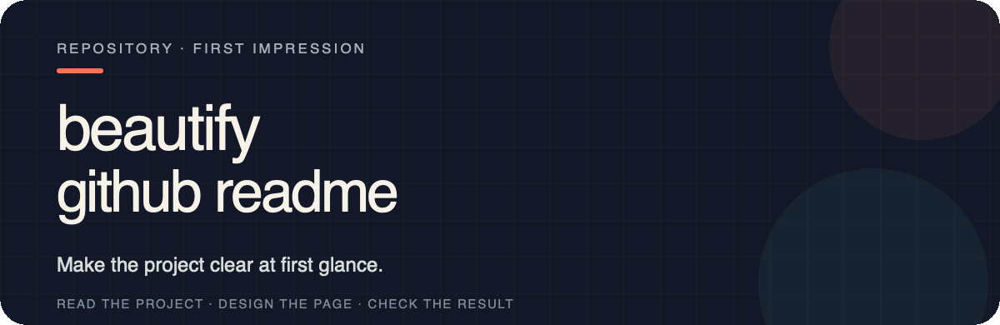
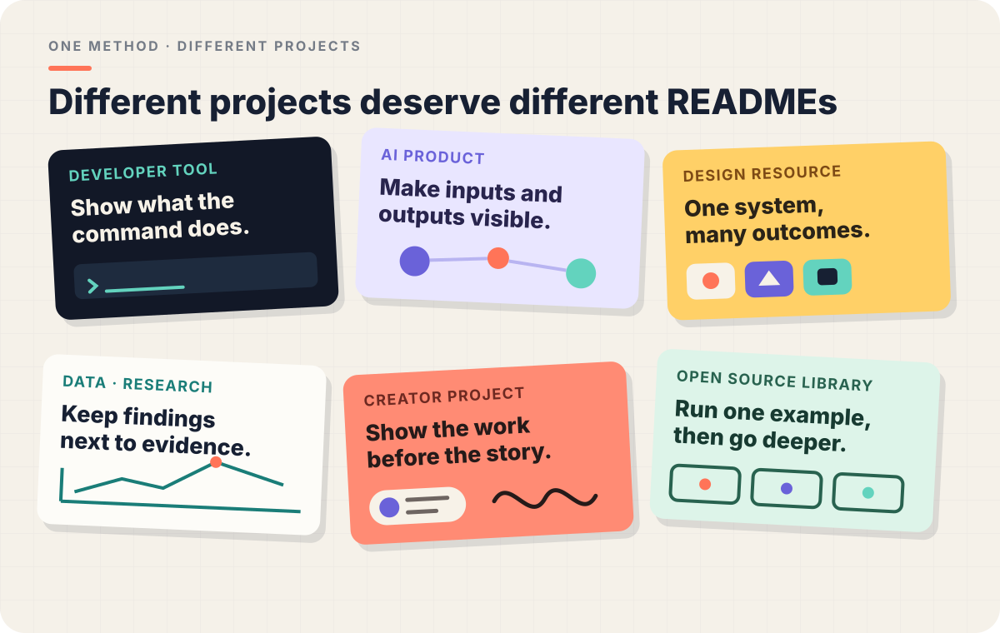
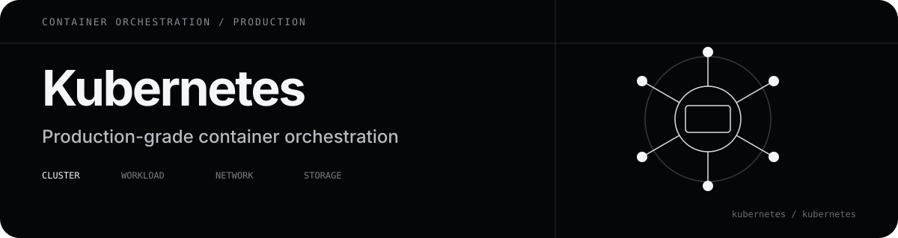
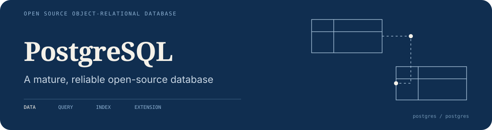
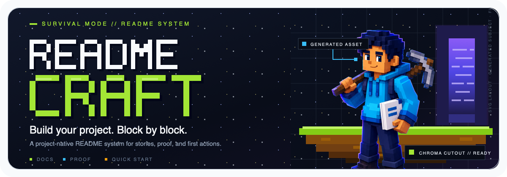
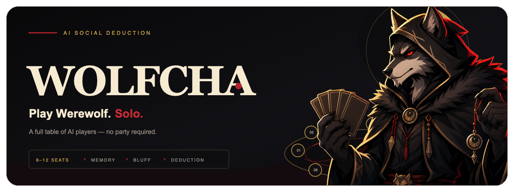
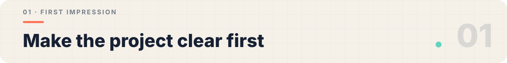
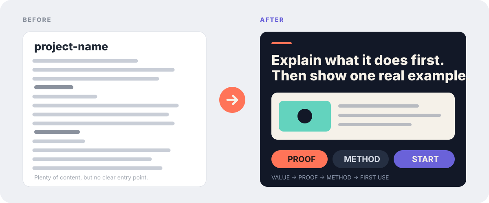
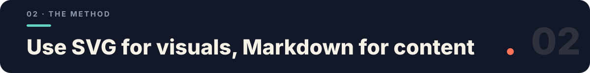
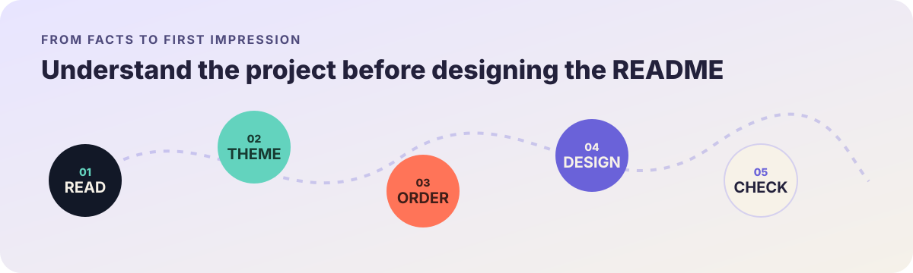

<p align="right">
  <strong>English</strong> · <a href="./README.es.md">Español</a> · <a href="./README.de.md">Deutsch</a>
</p>

<p align="center">
  
</p>

<p align="center">
  
</p>

Organize and design repository READMEs so that project value, real examples, installation paths, and usage boundaries are easier to understand.

Below are four independent hero directions. They do not share one house style; each derives its typography, color, composition, and proof from the project itself.

<p align="center">
  
</p>

<p align="center">
  
</p>

<p align="center">
  
</p>

**Block World** shows a playful hybrid direction: SVG builds the pixel typography, grid, labels, and scene structure, while ImageGen and chroma-key removal supply the character that would be cumbersome to draw deterministically.

<p align="center">
  
</p>

<p align="center">
  
</p>

Most repositories already contain enough information. The problem is usually the order: visitors see internal terminology, installation commands, and directory trees before they understand what the project is for.

`beautify-github-readme` reads the real repository first, identifies the clearest value and proof, and only then decides how the page should look.

<p align="center">
  
</p>

In whole-README mode, it works across three layers:

| Content | Visual system | Engineering |
| --- | --- | --- |
| Remove repetition, move proof forward, and replace internal jargon with concrete outcomes | Derive color, typography, composition, and project-native motifs before designing the hero and supporting modules | Keep assets GitHub-safe, images accessible, commands copyable, and body text searchable |

Different projects should not receive the same template. A CLI can use command rhythm and cursors; an icon system can use keylines and cutouts; a research repository can use coordinates, charts, and evidence labels.

<p align="center">
  
</p>

GitHub READMEs do not have the layout freedom of a website. This Skill separates the visual and content layers:

- SVG handles editable heroes, section transitions, comparisons, diagrams, and identity.
- Hybrid SVG composition combines deterministic SVG layout with optional AI-generated, background-removed subjects for characters, organic texture, complex materials, and cinematic lighting.
- GIF handles approved motion while the static SVG remains the editable fallback.
- Motion is opt-in and is never generated by default.
- PNG/WebP handles screenshots, generated artwork, and complex showcase walls.
- Markdown handles explanations, commands, links, configuration, and contribution details.

The result can feel designed without becoming one long image that nobody can search, copy, or maintain.

The reusable production guidance lives here:

- [Designing a project-native hero](./skills/beautify-github-readme/references/project-native-hero.md)
- [Writing GitHub-safe README SVGs](./skills/beautify-github-readme/references/svg-production.md)
- [Composing SVG with generated raster material](./skills/beautify-github-readme/references/hybrid-svg-production.md)
- [Producing GitHub-safe README motion](./skills/beautify-github-readme/references/motion-production.md)

<p align="center">
  
</p>

The process keeps three promises: use real project material, never invent capabilities, and never publish without explicit approval.

<p align="center">
  
</p>

**Option 1 · Install from the command line**

```bash
npx skills add unrealretamal/retalab-beatiful-repository
```

**Option 2 · Ask your Agent to install it**

```text
Install this Skill: https://github.com/unrealretamal/retalab-beatiful-repository
```

The Skill has two explicit modes:

| Mode | What it changes | What it leaves alone by default |
| --- | --- | --- |
| Whole README | Reading order, copy hierarchy, proof, Markdown, and the complete visual system | It will not commit, push, or publish without approval |
| Asset-only | A static SVG hero, section headers, workflow, badge, diagram, or an optional GitHub-safe GIF with SVG source | It will not edit README copy, order, image references, or links |

If the request already states the scope, the Skill starts directly. If a user only says "beautify this repository" or provides a repository URL, the Agent asks:

```text
Would you like me to improve the whole README or only create visual assets?
If asset-only, do you need a hero, section headers, workflow, badge, motion graphic, or a coordinated set?
```

**Whole-README mode**

```text
Use $beautify-github-readme to redesign this repository homepage around its real project theme.
Show me a local preview first and do not push anything.
```

**Asset-only mode**

```text
Use $beautify-github-readme to keep the README unchanged and create one animated GIF hero with its SVG source.
Derive the style from the existing project and show me the rendered preview first.
```

Reading a README for context does not grant permission to edit it. In asset-only mode, embedding the new assets requires a separate, explicit approval.

You can also request a read-only audit:

```text
Use $beautify-github-readme to audit this README for clarity, hierarchy, trust, and maintenance cost. Do not edit files.
```

Whole-README mode delivers a local preview, visual assets, and a README diff. Asset-only mode delivers source assets, rendered previews, optional GIF derivatives, and embed snippets. Commits, pushes, PRs, and publishing always require explicit authorization.

MIT License

---

This README is also a working example: it combines a project-native hero, a theme wall, illustrative examples, section transitions, and readable Markdown instead of rasterizing the whole page.

## Configuration, Dependencies & Usage Boundaries

Markdown/SVG itself requires no account or API Key; generating PNG/WebP or using AI image generation requires the corresponding rendering and authorized generation tools.

Do not fabricate stars, performance, users, or brand endorsements; after modifications, check links, assets, and actual rendering. Publishing and merging comply with the current task authorization.

Usage example:

```text
Beautify this repository's README homepage, preserving real project facts.
```
